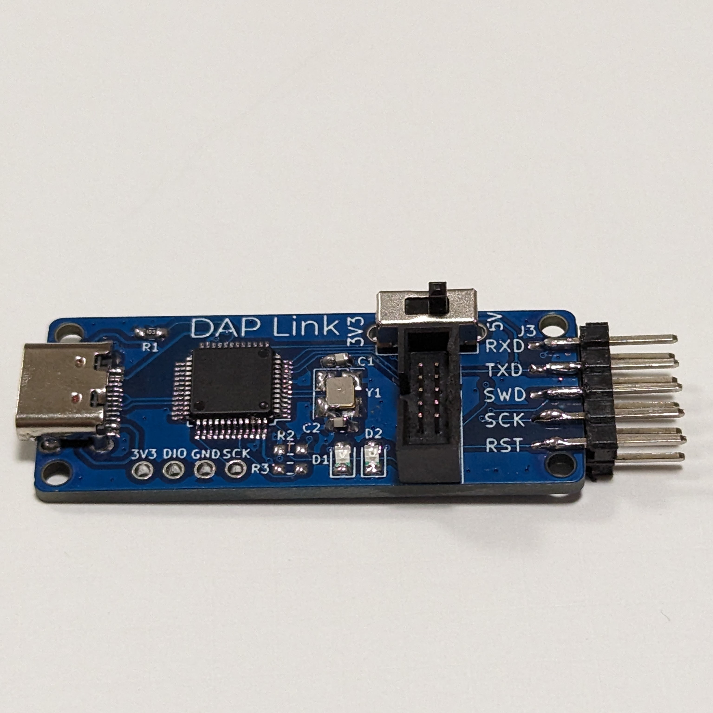
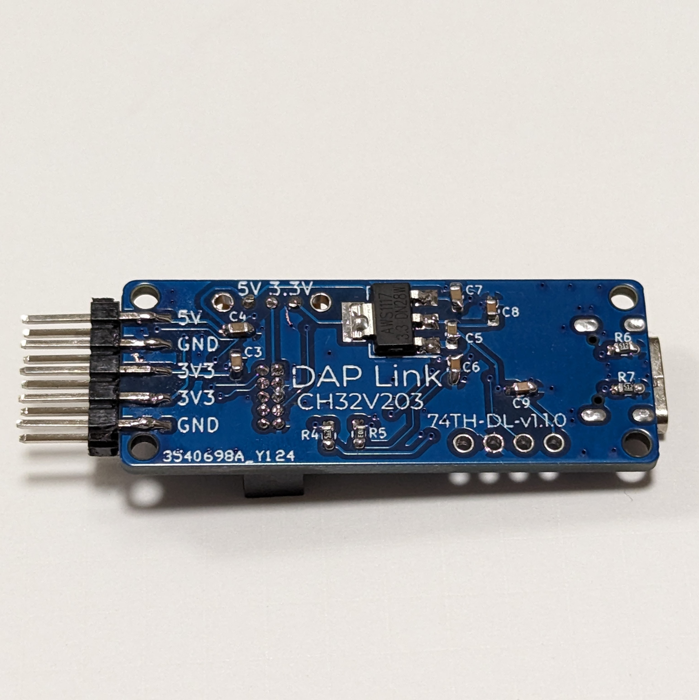
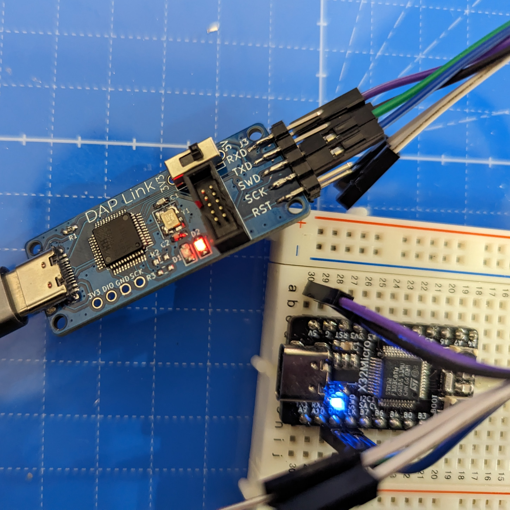
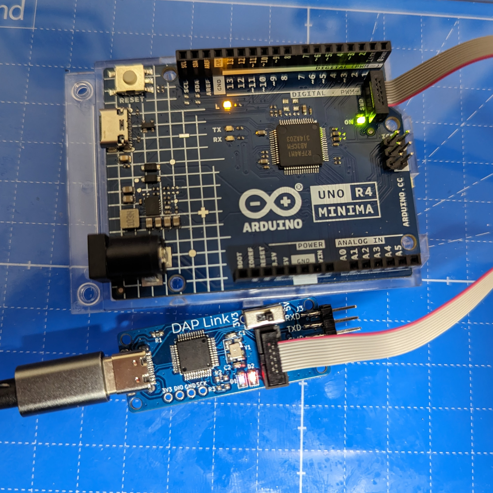
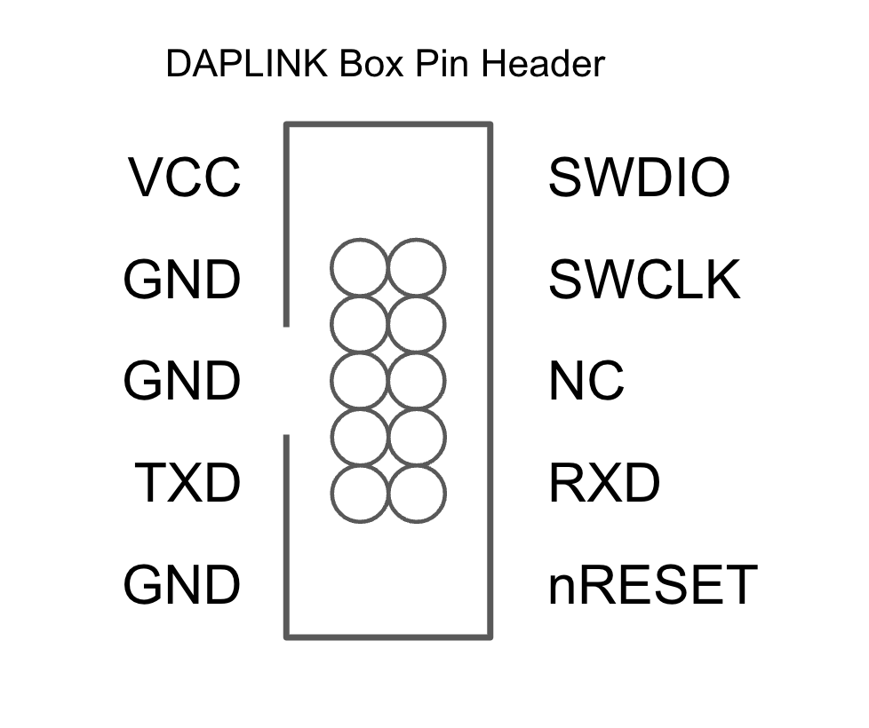

# CH32V203 を利用した DAPLink

- Shop: https://booth.pm/ja/items/4916891

## features

- SWD のデバッガとして使える
- USB シリアル変換として使える
- 1.27mm ピッチ 10 ピンの SWD と互換性のあるポートを持っている（ただし SWO はなし）
- Arduino UNO R4 の SWD + UART の 1.27mm ピッチ 10 ピンと互換性のあるポートを持っている
- 10 ピンコネクタの VCC を 5V、3.3V を切り替えることができる（Arduino UNO R4 では 5V が必要）
- USB-C

## SWD 10pin Connector

## Firmware

https://github.com/XIVN1987/DAPLink/tree/master/CH32V203

## v1.1.0

R2、R3 は NC にすること。

- semantics: [ch32v203-daplink-v1.1.0-semantics.pdf](ch32v203-daplink-v1.1.0-semantics.pdf)
- pcb: [ch32v203-daplink-v1.1.0-pcb.pdf](ch32v203-daplink-v1.1.0-pcb.pdf)

## LICENSE

- Firmware: https://github.com/XIVN1987/DAPLink/blob/master/LICENSE
- PCB: MIT
